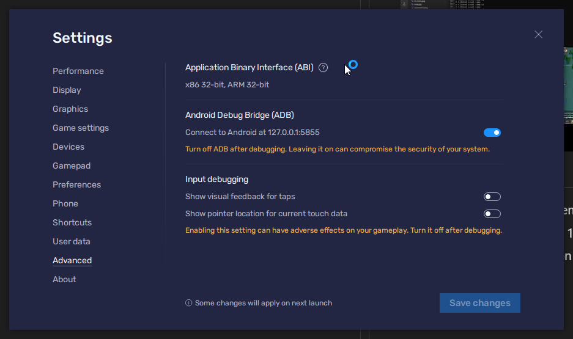
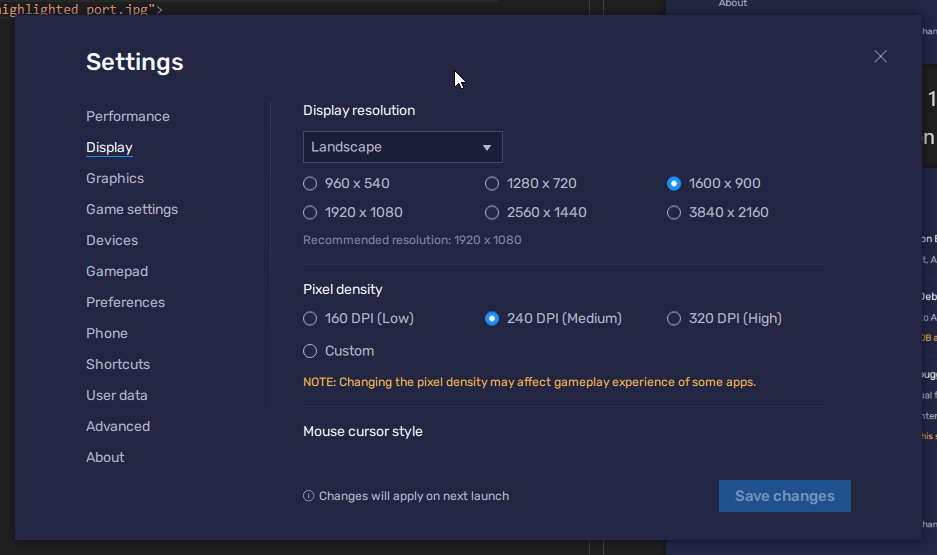
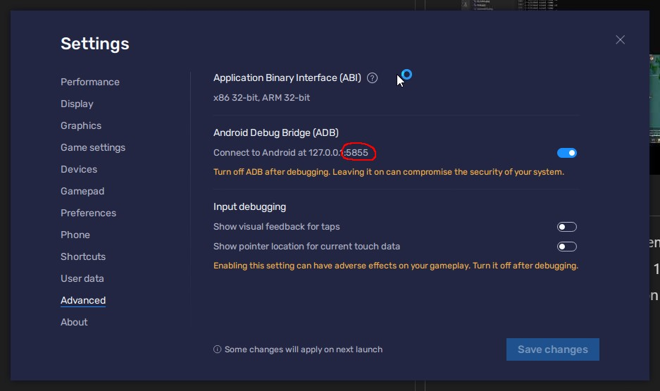
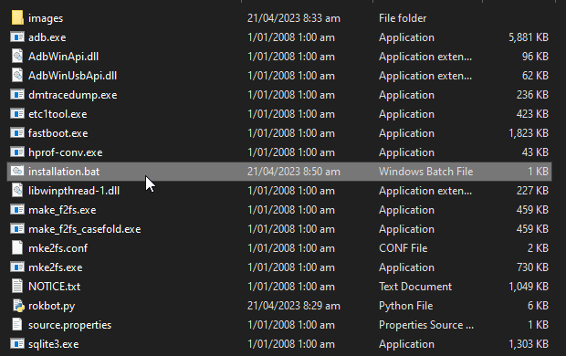
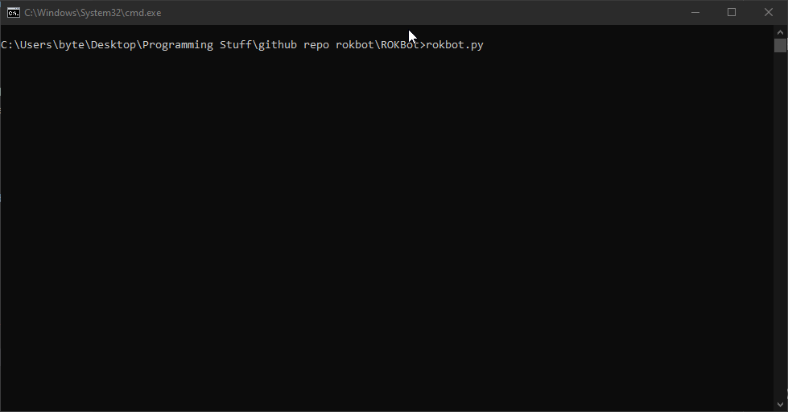

# ROK Bot/Automator

# Working but very primitive, will speed it up in the future. However it works

# Demo:

[](https://www.youtube.com/watch?v=GIQA0BHdzqI)

# Setup Guide

## Enable ADB on your chosen emulator


## Set your screen resolution to 1600x900



## Set your PORT in rokbot.py on line 4


## Run installation.bat 


## Open a terminal in the directory 'ROKBOT' and type/run 'rokbot.py'


# To-do
```
Tutorial Bot
Barbarian Spawner
Discord integration
GUI or Webpanel
Village/Cave claimer
```

# Disclaimer: I am not responsible for you getting banned, run this program at your own risk.

